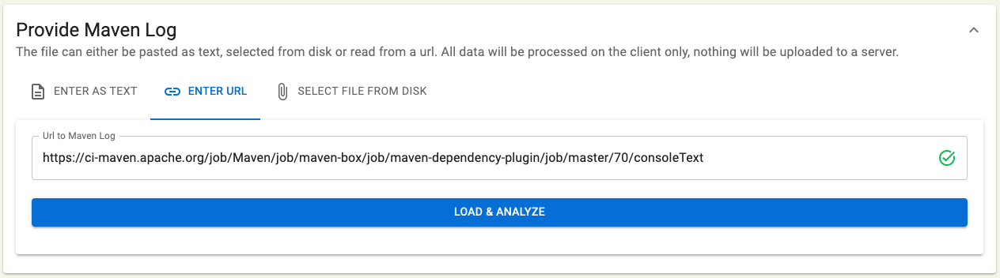
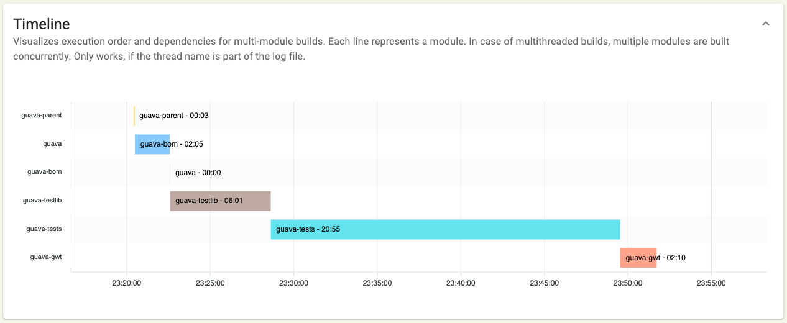
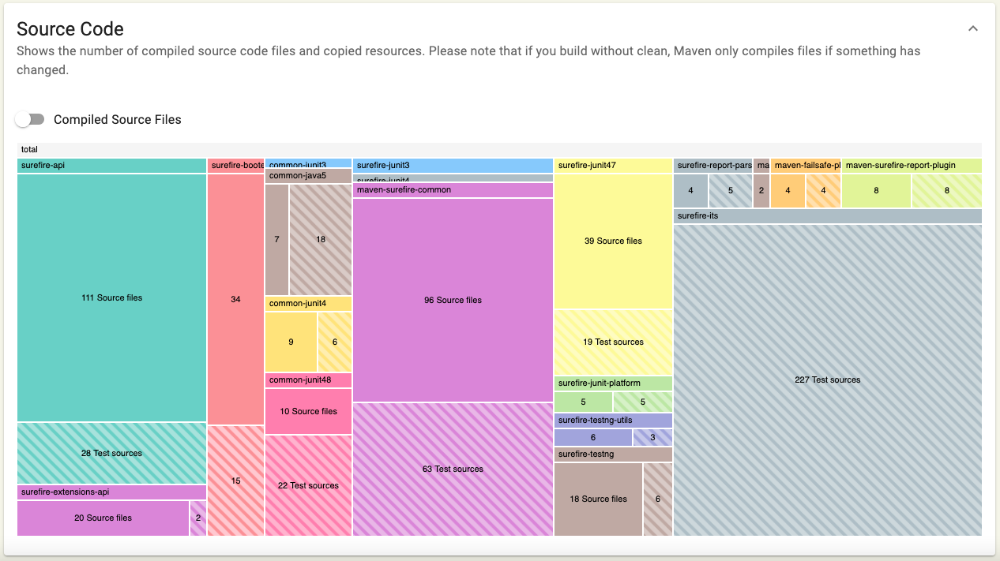

# Maven Build Performance Analyzer

A tool to analyze Maven log files graphically.

### Features

* Load log file from multiple source: text field, url, local file
* Client-side analysis directly in Browser only. Data will not be sent to any server.
* Visualize timeline for multi-module projects.
* Aggregated durations per maven plugin.
* Treemaps for compiled sources and copied resources.
* General build statistics. 

### Screenshots

### Known Issues
* Timeline & source treemap incorrect for multithreaded builds

### Try it out
<a href="http://maven-performance-analyzer.vercel.app/">Demo</a>
